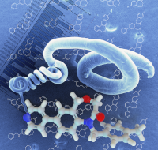
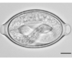
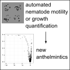
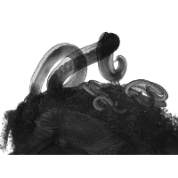

```{r setup, include=FALSE}
knitr::opts_chunk$set(echo = TRUE)
```
#### School of Life Sciences, University of Westminster
[[Google Scholar]](https://scholar.google.co.uk/citations?user=u_hixhoAAAAJ)
[[ORCiD]](https://orcid.org/0000-0001-6236-4297)

<!--### Preprints-->

### Publications

Ramos-Sevillano E, Ercoli G, Betts M, Guerra-Assunção JA, Iverson A, Frank M, **Partridge F**, Lo SW, Fernandes VE, Nasher F, Wall E, Wren B, Gordon SB, Ferreira DM, Heyderman R, Rosch J, Brown JS.  
[Essential role of proline synthesis and the one-carbon metabolism pathways for systemic virulence of _Streptococcus pneumoniae_](https://journals.asm.org/doi/full/10.1128/mbio.01758-24?rfr_dat=cr_pub++0pubmed&url_ver=Z39.88-2003&rfr_id=ori%3Arid%3Acrossref.org)  
_mBio_ 2024 Nov 13;15(11):e0175824.  
[[link]](https://doi.org/10.1128/mbio.01758-24)
[[pdf]](pdfs/ramos-sevillano2024mbio.pdf)
[[preprint]](https://www.biorxiv.org/content/10.1101/2023.08.03.550501v1.article-info)

Coghlan A\*, **Partridge FA**\*, Duque-Correa MA\*, Rinaldi G\*, Clare S, Seymour L, Brandt C, Mkandawire TT, McCarthy C, Holroyd N, Nick M, Brown AE, Tonitiwong S, Sattelle DB, Berriman M (\*contributed equally)    
[A drug repurposing screen for whipworms informed by comparative genomics.](https://doi.org/10.1371/journal.pntd.0011205)  
_PLoS Negl Trop Dis_ 2023 17(9): e0011205. 
[[link]](https://doi.org/10.1371/journal.pntd.0011205) 
[[pdf]](pdfs/coghlan2023plosntds.pdf) 
[[preprint]](https://www.biorxiv.org/content/10.1101/2023.03.02.530747v1)

Nick M, **Partridge FA**, Forman R, Bataille CJR, Else KJ, Russell AJ, Sattelle DB  
[Screening the Medicines for Malaria Venture (MMV) Pandemic Response Box chemical library on _Caenorhabditis elegans_ identifies re-profiled candidate anthelmintic drug leads](https://www.frontiersin.org/articles/10.3389/fitd.2022.1017900/full)  
_Front. Trop. Dis._ 2022 3:1017900. doi: 10.3389/fitd.2022.1017900 [[link]](https://www.frontiersin.org/articles/10.3389/fitd.2022.1017900/full)
[[pdf]](pdfs/nick2022fronttropdis.pdf)
[[preprint]](https://www.biorxiv.org/content/10.1101/2022.08.10.503491v1)

Forman R, **Partridge FA**, Sattelle DB, Else KJ  
[Un-‘Egg’-Plored: Characterisation of Embryonation in the Whipworm Model Organism _Trichuris muris_](https://www.frontiersin.org/articles/10.3389/fitd.2021.790311/full)  
_Frontiers in Tropical Diseases_ 2021 2, 45 
[[link]](https://www.frontiersin.org/articles/10.3389/fitd.2021.790311/full)
[[pdf]](pdfs/forman2021fronttropdis.pdf)  

**Partridge FA**\*, Poulton BC\*, Lake, MAI\*, Lees, RA, Mann H-J, Lycett GJ, Sattelle DB (\*contributed equally)  
[Actions of camptothecin derivatives on larvae and adults of the arboviral vector _Aedes aegypti_](https://www.mdpi.com/1420-3049/26/20/6226)  
_Molecules_ 2021 26, 6226
[[link]](https://www.mdpi.com/1420-3049/26/20/6226)
[[pdf]](pdfs/partridge2021molecules.pdf)
[[preprint]](https://www.biorxiv.org/content/10.1101/2021.09.06.458863)

Buckingham SD\*, **Partridge FA**\*, Poulton BC\*, Miller BS\*, McKendry RA, Lycett GJ, Sattelle DB (\*contributed equally)  
[Automated phenotyping of mosquito larvae enables high-throughput screening for novel larvicides and smartphone-based detection of larval insecticide resistance](https://journals.plos.org/plosntds/article?id=10.1371/journal.pntd.0008639)  
_PLOS Negl Trop Dis_ 2021 15(6): e0008639
[[link]](https://journals.plos.org/plosntds/article?id=10.1371/journal.pntd.0008639)
[[pdf]](pdfs/buckingham2021plosntds.pdf)
[[preprint]](https://www.biorxiv.org/content/10.1101/2020.07.20.211946v2) 

<div class="well clearfix">
<div style="width:120px; float:left; padding-right:15px"></div>
<div style="overflow:hidden;">**Partridge FA**\*, Bataille CJR\*, Forman R\*, Marriott AE\*, Forde-Thomas J\*, Häberli C\*, Dinsdale RL, O'Sullivan JDB, Willis N, Wynne GM, Whiteland H, Archer J, Steven A,  Keiser J, Turner JD, Hoffmann KF, Taylor MJ, Else KJ, Russell AJ, Sattelle DB (\*contributed equally)  
[Structural requirements for dihydrobenzoxazepinone anthelmintics: actions against medically important and model parasites - _Trichuris muris, Brugia malayi, Heligmosomoides polygyrus_ and _Schistosoma mansoni_](https://pubs.acs.org/doi/10.1021/acsinfecdis.1c00025)  
_ACS Infectious Diseases_ 2021 7, 1260−1274 [[link]](https://pubs.acs.org/doi/10.1021/acsinfecdis.1c00025)
[[pdf]](pdfs/partridge2021acsid.pdf)
[[preprint]](https://www.biorxiv.org/content/10.1101/2020.11.17.384933v2)
</div>
</div>


**Partridge FA**\*, Forman R\*, Bataille CJR\*, Wynne GM, Nick M, Russell AJ, Else KJ, Sattelle DB (\*contributed equally)  
[Anthelmintic drug discovery: target identification, screening methods and the role of open science](https://www.beilstein-journals.org/bjoc/articles/16/105)  
_Beilstein J. Org. Chem._ 2020 16, 1203–1224.
[[link]](https://www.beilstein-journals.org/bjoc/articles/16/105)
[[pdf]](pdfs/partridge2020bjoc.pdf)

Faravelli G\*, Raimondi S\*, Marchese L, **Partridge FA**, Soria C, Mangione PP, Canetti D, Perni M, Aprile FA, Zorzoli I, Di Schiavi E, Lomas DA, Bellotti V, Sattelle DB, Giorgetti S (\*contributed equally)  
[_C. elegans_ expressing D76N β~2~-microglobulin: a model for _in vivo_ screening of drug candidates targeting amyloidosis.](https://www.nature.com/articles/s41598-019-56498-5)  
_Sci Rep_ 2019 9, 1–10
[[link]](https://www.nature.com/articles/s41598-019-56498-5)
[[pdf]](pdfs/faravelli2019scirep.pdf)

Matthews BJ\*, Dudchenko O\*, Kingan SB\*, Koren,  S, Antoshechkin I, Crawford JE, Glassford WJ, Herre M, Redmond SN, Rose NH, Weedall GD, Wu Y, Batra SS, Brito-Sierra CA, Buckingham SD, Campbell CL, Chan S, Cox E, Evans BR, Fansiri T, Filipovic I, Fontaine A, Gloria-Soria A, Hall R, Joardar VS, Jones AK, Kay RGG, Kodali V, Lee J, Lycett GJ, Mitchell SN, Muehling J, Murphy MR, Omer AD, **Partridge FA**, Peluso P, Aiden AP, Ramasamy V, Rašić G, Roy S, Saavedra-Rodriguez K, Sharan S, Sharma A, Smith ML, Turner J, Weakley AM, Zhao Z, Akbari OS, Black WC, Cao H, Darby AC, Hill CA, Johnston JS, Murphy TD, Raikhel AS, Sattelle DB, Sharakhov IV, White BJ, Zhao L, Aiden EL, Mann RS, Lambrechts L, Powell JR, Sharakhova MV, Tu Z, Robertson HM, McBride CS, Hastie AR, Korlach J, Neafsey DE, Phillippy AM, Vosshall LB (\*contributed equally)  
Improved reference genome of _Aedes aegypti_ informs arbovirus vector control. _Nature_ 2018 563:501-507. 
[[link]](https://www.nature.com/articles/s41586-018-0692-z)
[[pdf]](pdfs/matthews2018nature.pdf)
[[preprint]](https://doi.org/10.1101/240747)

<div class="well clearfix">
<div style="width:120px; float:left; padding-right:15px"></div>
**Partridge FA**\*, Forman R\*, Willis NJ\*, Bataille CJR\*, Murphy EA, Brown AE, Heyer-Chauhan N, Marinič B, Sowood DJC, Wynne GM, Else KJ, Russell AJ, Sattelle DB, 2018 (\*contributed equally).  
2,4-Diaminothieno[3,2-_d_]pyrimidines, a New Class of Anthelmintic with Activity against Adult and Egg Stages of Whipworm.  _PLoS Negl Trop Dis_ 2018 12(7):e0006487  [[link]](http://journals.plos.org/plosntds/article?id=10.1371/journal.pntd.0006487)
[[pdf]](pdfs/partridge2018plosntds.pdf)
[[preprint]](https://doi.org/10.1101/254037)
</div>

Furutani S\*, Ihara M\*, Lees K\*, Buckingham SD\*, **Partridge FA**, David JA, Patel R, Warchal S, Mellor IR, Matsuda K, Sattelle DB. (\*contributed equally)  
The fungal alkaloid Okaramine-B activates an L-glutamate-gated chloride channel from _Ixodes scapularis,_ a tick vector of Lyme disease. _International Journal for Parasitology: Drugs and Drug Resistance_. 2018 8(2):350-360 [[link]](https://doi.org/10.1016/j.ijpddr.2018.06.001) [[pdf]](pdfs/furutani2018ijpddr.pdf)

<div class="well clearfix">
<div style="width:120px; float:left; padding-right:15px"></div>
**Partridge FA\*,** Brown AE\*, Buckingham SD\*, Willis NJ, Wynne GM, Forman R, Else KJ, Morrison AA, Matthews JB, Russell AJ, Lomas DA, Sattelle DB (\*contributed equally)  
An automated high-throughput system for phenotypic screening of chemical libraries on _C. elegans_ and parasitic nematodes. _International Journal for Parasitology: Drugs and Drug Resistance_ 2018 8(1):8-21 [[link]](https://doi.org/10.1016/j.ijpddr.2017.11.004) [[pdf]](pdfs/partridge2018ijpddr.pdf)
[[preprint]](https://doi.org/10.1101/187427)
</div>
<div class="well clearfix">
<div style="width:120px; float:left; padding-right:15px"></div>
**Partridge FA\*,** Murphy EA\*, Willis NJ\*, Bataille CJ, Forman R, Heyer-Chauhan N,
Marinič B, Sowood DJ, Wynne GM, Else KJ, Russell AJ, Sattelle DB (\*contributed equally)  
Dihydrobenz[_e_][1,4]oxazepin-2(3*H*)-ones, a new anthelmintic chemotype immobilising
whipworm and reducing infectivity _in vivo._
_PLoS Negl Trop Dis._ 2017 Feb
9;11(2):e0005359.
[[link]](http://dx.doi.org/10.1371/journal.pntd.0005359)
[[pdf]](pdfs/partridge2017plosntds.pdf)
</div>

Buckingham SD, **Partridge FA,** Sattelle DB. Automated, high-throughput, motility
analysis in _Caenorhabditis elegans_ and parasitic nematodes: Applications in the
search for new anthelmintics. _Int J Parasitol Drugs Drug Resist._ 2014 Oct
30;4(3):226-32.
[[link]](http://dx.doi.org/10.1016/j.ijpddr.2014.10.004)

Hurst RJ, Hopwood T, Gallagher AL, **Partridge FA,** Burgis T, Sattelle DB, Else
KJ. An antagonist of the retinoid X receptor reduces the viability of _Trichuris
muris_ in vitro. _BMC Infect Dis._ 2014 Sep 27;14:520.
[[link]](http://dx.doi.org/10.1186/1471-2334-14-520)

Anderson A, Laurenson-Schafer H, **Partridge FA,** Hodgkin J, McMullan R.
Serotonergic chemosensory neurons modify the _C. elegans_ immune response by
regulating G-protein signaling in epithelial cells. _PLoS Pathog._
2013;9(12):e1003787.
[[link]](http://dx.doi.org/10.1371/journal.ppat.1003787)

**Partridge FA,** Gravato-Nobre MJ, Hodgkin J. Signal transduction pathways that
function in both development and innate immunity. _Dev Dyn._ 2010
May;239(5):1330-6.
[[link]](http://dx.doi.org/10.1002/dvdy.22232)

Hodgkin J, **Partridge FA.** _Caenorhabditis elegans_ meets microsporidia: the
nematode killers from Paris. _PLoS Biol._ 2008 Dec 23;6(12):2634-7
[[link]](http://dx.doi.org/10.1371/journal.pbio.1000005)

**Partridge FA,** Tearle AW, Gravato-Nobre MJ, Schafer WR, Hodgkin J. The _C.
elegans_ glycosyltransferase BUS-8 has two distinct and essential roles in
epidermal morphogenesis. _Dev Biol._ 2008 May 15;317(2):549-59.
[[link]](http://dx.doi.org/10.1016/j.ydbio.2008.02.060)

### Software
[INVAPP / Paragon](https://github.com/fpartridge/invapp-paragon) 
An automated system for analysing worm movement/growth from movies. [[doi]](http://doi.org/10.5281/zenodo.1064045)

